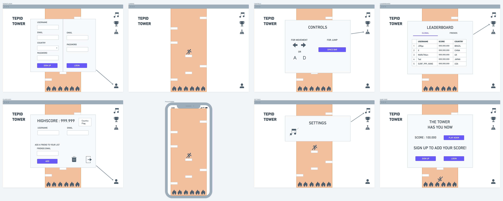
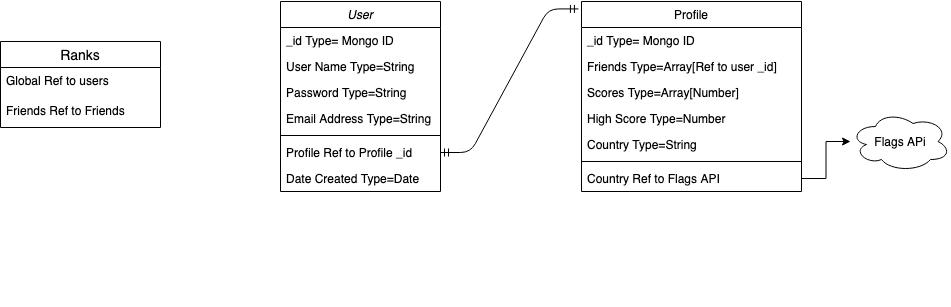

# Project 3 - Capstone Project - TEPID TOWER

INSPIRED BY ICY TOWER

## Contents

* **[FRONTEND REPO](https://git.generalassemb.ly/heymon/frontend-tepid-tower)**
* **[BACKEND REPO](https://git.generalassemb.ly/heymon/backend-tepid-tower)**

## **Scope** 
---
For this project I will try to push html and css to the best of my abilities with the help of React's OOP functionalities and create a infinite jumper gamer.
My ultimate goal is to to build a full flege game but in the time frime of this project I believe I wil be able to implement:

* The game main functionalites as far as movement and "physics"

* A Frontend Server in React to handle the game itself

* A MongoDB database to keep track of users/players 

* A Backend server with Node.js and Express to keep track of the database

What are you planning to build? What do you reasonably think you can implement in the time period?

## **User Stories** 
---

*  The player will start on the Landing page with the game level already loaded

* Game controls will briefly show and then fade. 

* ON the top right there will be 3 interactable icons

    * If player wants to see the controls again they can click the joystick icon

    * By clicking on the trophy icon the LeaderBoards will show up

    * Clicking the music icon will toggle background music on and off 

* Player will be able to move the character and start the game as soon as they land in the first platform

* Player can move the character with arrow keys or A/D and jump with Space Bar

* While the character goes up the platforms will start to come down

* If the character falls from the platform, that's game over, a pop up displaying the player's score will pop up and ask if the player wants to play again, or signup/login to save their score

   * If player choose to play again it will restart the level
   * If player chooses login/signup it will change the popup to a form:
        * username, email, country, password for signing up 
        * email and password for login

* If player wants to access their information they will be able to do so by clicking the player icon on the bottom right part of the page

* The player's info card will pop pup with their username, email and country

    * username and email are both editable by typing in the input box

    * The player will also be able to add friends by typing their email in the "add friend" input

* Player will also be able to log out or delete their account by clicking the respective icons on the bottom right of the pop up

## **WIREFRAMES** 
---

#  

## **DATABASE** 
---

#  

## **MILESTONES** 
---

### **MVP**

1. Define and develop of the functionalities and necessary classes for the game flow inside the page

2. Create the React frontend server to contain and handle the game

3. Create Backend server using Node.js, Express, Mongoose and MongoDB to hold user data

### **LATER ITERATIONS**

4. Implement Flags API to display users countries flags

5. Implement different LeaderBoards depending on user data, e.i. Friends, Country

6. Add Responsive design for mobile and movement based on phone rotation

7. Better "physics" and more level iteraction
