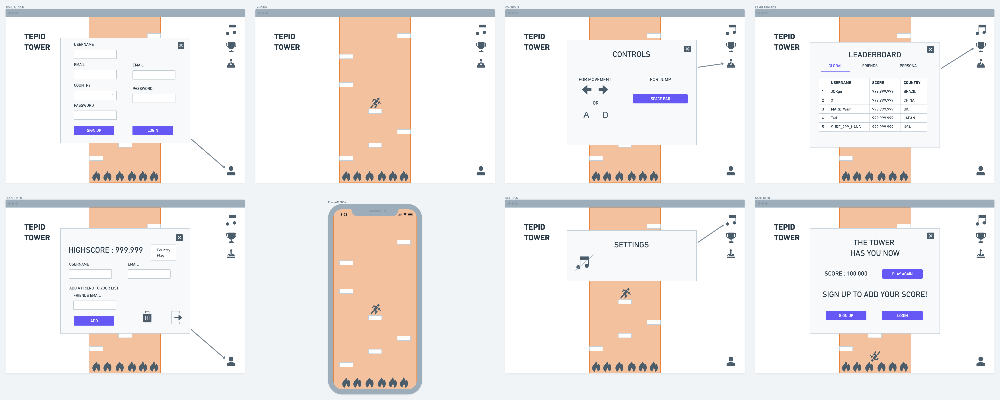

<!-- #   -->
# Project 3 - Capstone Project - TEPID TOWER

**Read this entire document before writing a line of code.**

## Contents

* **[Overview](#overview):** What is this project?
* **[Big Goals](#big-goals):** What should I focus on?
* **[Technical Requirements](#technical-requirements):** What technologies will I be using?
* **[Further Exploration](#further-exploration):** What if I want to do more?
* **[Planning & Deliverables](#planning--deliverables):** What will I be turning in?
* **[Deadlines](#deadlines):** When is the project due?
* **[Submission](#submission):** How do I turn in the project?
* **[Presentation Guidelines](#presentation-guidelines):** What should I cover during my presentation?
* **[Project Feedback](#project-feedback):** How will I get feedback from instructors?

---

## Overview

###### What is this project?

**You’ve come a long way, and it's time to show it.** This will be your most advanced project to date, and it'll hopefully be the shining beacon of bragging rights for your portfolio as you make your way out into the world of web development.

**You get to call the shots and invent your own idea**, choosing a framework and tools that are appropriate for what you want to build. Use everything you've learned so far, and **tackle something that'll push you a little outside of your comfort zone**.

Make sure it's **something you can accomplish in the limited time we have**, and make sure it's **something that will be visually impressive**.

**You will work on this project individually** See the [project planning deliverables](#project-planning-deliverables).

---

## Big Goals

###### What should I focus on?

* **Discover or invent an idea**, preferably one with some group of users that would jump at the chance to really use your product.
* **Design a product *you* want to build**, and choose _appropriate technologies_ to build it.
* **Pitch your idea** to your classmates and instructors, and incorporate their feedback.
* **Make productive use of your time**, and balance responsibilities to make a complete, impressive-looking project.
* **Focus on writing solid, real-world code** that is well-documented and DRY.

---

## Technical Requirements

###### What technologies will I be using?

**Your app must meet the following technical requirements:**

* **Use a database**, whether it's one we've covered in class or one you want to learn.
* **Build a full-stack application** by making your own back-end and your own front-end.
* **Create a complete product**, which most likely means multiple related resources and CRUD functionality for each.
* **Create a focused product**. Know which features are essential to build for your MVP and which to set aside for later.
* **Craft thoughtful user stories** that are significant enough to help you ensure a pleasing and logical user experience.
* **Handle errors gracefully**, and provide useful feedback to users when errors or validation failures do occur.
* **Make a product that's impressive-looking**; up your design and style game to kick your portfolio up a notch.
* **Deploy your application online** so it's publicly accessible.

---

## Further Exploration

###### What if I want to do more?

* **Incorporate an external API** to add data and functionality to your application.
* **Use a data visualization library** to help users understand your core data.
* **Implement third-party log in** to allow users to access data from other services.
* **Build something you can really launch**, and recruit an actual user-base.
* **Test** critical components of your code to ensure that it works.

---

## Planning & Deliverables

###### What will I be turning in?

### Project Planning Deliverables

**You should review the following with your instructional team BEFORE you start to code.**

* **User Stories:** Who is your user? What features will your app have? Set up your project and user stories in <a href="https://trello.com" target="_blank">Trello</a>.
* **Wireframes:** Sketch out what your core pages will look like and how they will work. Consider making a *paper prototype* to demonstrate and/or test key user interactions.
* **Data Models:** Draw out the models and any associations for your project in an entity relationship diagram (ERD).
* **Milestones:** Divide your work into parts - the most essential features for your MVP, features that are important but not essential, and features that can be saved for a later iteration. Create 3-5 major milestones with dates outlining when you expect essential features will be done.
* **Feasibility Study:** If you're using an external API or scraping a website, make sure you can get that data. If you're using a new language, framework, or tool, go through its getting started tutorial. We *will* ask to see your results.

## **Scope** 
---
For this project I will try to push html and css to the best of my abilities with the help of React's OOP functionalities and create a infinite jumper gamer.
My ultimate goal is to to build a full flege game but in the time frime of this project I believe I wil be able to implement:

* The game main functionalites as far as movement and "physics"

* A Frontend Server in React to handle the game itself

* A MongoDB database to keep track of users/players 

* A Backend server with Node.js and Express to keep track of the database

What are you planning to build? What do you reasonably think you can implement in the time period?

## **User Stories** 
---

*  will start on the Landing page with the game level already loaded

* Game controls will briefly show and then fade. If player wants to see the controls again they may click the controls menu on top rigth

* Player will be able to move the character and start the game as soon as they land in the first platform

* Player can move the character with arrow keys or A/D and jump with Space Bar

* While the character goes up the platforms will start to come down

* If the character falls from the platform, that's game over, a pop up displaying the player's score will pop up and ask if the player wants to play again, or signup/login to save their score

   * If player choose to play again it will restart the level
   * If player chooses login/signup it will change the popup to a form:
        * username, email, country, password for signing up 
        * email and password for login

* By clicking on the player icon on the bottom right 

* If player wants to access their information they will be able to do so by clicking the player icon on the bottom right part of the page

* The player's info card will pop pup with their username, email and country

* There player will be able to add friends by typing their email
* Player will also be able to log out or delete their account by clicking the respective icons on the bottom right of the pop up

## **WIREFRAMES** 
---

#  

## **DATABASE** 
---

#  